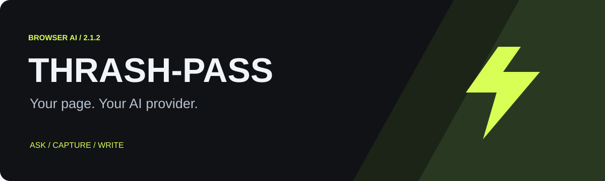
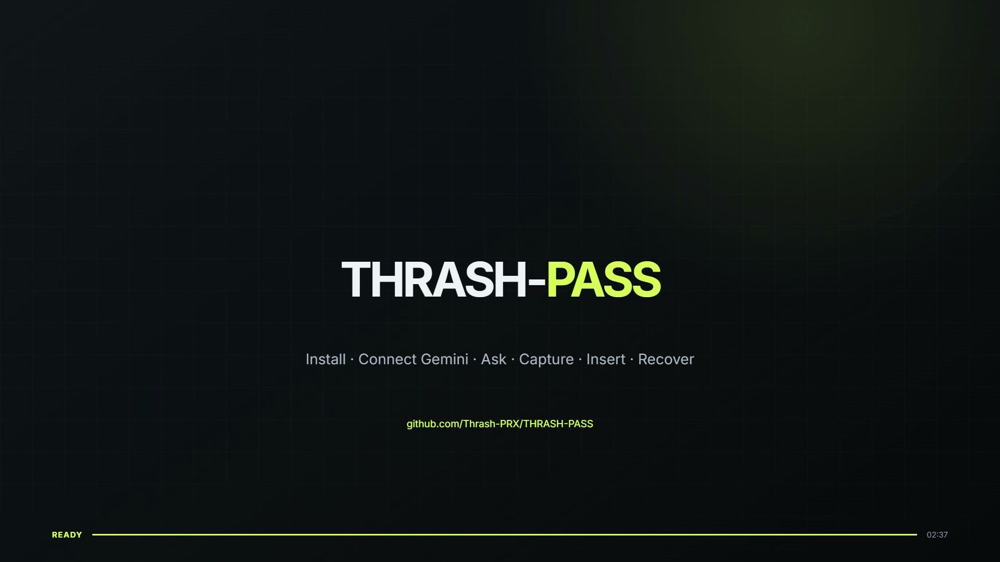

# THRASH-PASS

**Your page. Your AI provider.** A lightweight browser assistant for asking about webpages, understanding screenshots, and bringing answers into your editor.

Manifest V3 · Version 2.1.4 · Chrome / Chromium · No build step · Bring your own API key

## Features

- Ask about selected text or the current page in a floating panel.
- Connect Gemini, OpenAI, Kimi / Moonshot, or a custom OpenAI-compatible endpoint.
- Send visible-tab screenshots through Gemini or OpenAI with an image-capable model.
- Copy answers, paste into the last focused editor, or insert gradually with Auto-type.
- Presentation Mode hides the panel and blocks new page requests, captures, and insertions.

## Install

1. Choose **Code → Download ZIP** on this repository and extract it.
2. Open `chrome://extensions` (or `edge://extensions`) and enable **Developer mode**.
3. Click **Load unpacked** and select the **extension** folder containing `manifest.json`.
4. Pin THRASH-PASS to the toolbar and refresh existing webpages.

This is a manually installed extension, not a Chrome Web Store listing. Node.js is not needed to use it.

## Tutorial: Get an API key and start using THRASH-PASS

### 1. Get an API key from your provider

Pick one provider and create a key:

| Provider | Where to get a key | Typical free / starter model |
| --- | --- | --- |
| **Google Gemini** | [aistudio.google.com/apikey](https://aistudio.google.com/apikey) | `gemini-2.5-flash` or `gemini-3.8-flash` |
| **OpenAI** | [platform.openai.com/api-keys](https://platform.openai.com/api-keys) | `gpt-4o-mini` |
| **Kimi / Moonshot** | [platform.moonshot.cn](https://platform.moonshot.cn) | `moonshot-v1-8k` |
| **Custom** | Your own OpenAI-compatible server | Whatever model ID your server exposes |

- Gemini: sign in with a Google account → Create API key → copy it.
- OpenAI: create an account / log in → API keys → Create new secret key → copy it (you only see it once).
- Kimi / Moonshot: register → API Key management → create and copy the key.
- Custom: you need the full chat-completions URL (for example `https://your-server/v1/chat/completions`) and a model name.

Keep the key private. THRASH-PASS stores it only in your browser (`chrome.storage.local`).

### 2. Add the key in the extension

1. Click the **THRASH-PASS** icon in the Chrome toolbar.
2. Choose the **AI provider** (Gemini, OpenAI, Kimi, or Custom).
3. Paste your **API key**.
4. Enter a **Model ID** (or leave the default for that provider).
5. For Custom only: fill in the full **endpoint** URL.
6. Click **Save settings**.
7. Click **Test connection**. You should see a short success message (for example `Connected: THRASH-PASS OK`).

Optional for Gemini:
- Click **Refresh Gemini models** to list models available to your key, then pick one from the dropdown.

### 3. Use the assistant on any webpage

1. Open a normal webpage and refresh it once after installing the extension.
2. Select some text (optional) and either:
   - Right-click → **Ask THRASH-PASS about selection**, or
   - Press **Ctrl+Shift+Y** (Mac: **⌘+Shift+Y**), or
   - Right-click the page → ask about the page.
3. A floating panel appears. Type your question and click **Ask AI** (or press Ctrl/⌘+Enter).
4. To include a screenshot of the visible tab, click **Screenshot** instead.
5. When the answer arrives you can:
   - **Copy** the answer
   - **Paste code** into the last editor you focused
   - **Auto-type** the answer character-by-character into that editor

Supported insertion targets: text inputs, textareas, contenteditable areas, and common Monaco / CodeMirror 5 / Ace editors.

### 4. Presentation Mode (optional)

Turn **Presentation Mode** on in the popup when you do not want the assistant visible.

- The floating panel is removed.
- New page requests, screenshots, and insertions are blocked.
- Context menus and the keyboard shortcut stop working until you turn it off and refresh the page.

### Quick checklist if something does not work

- Refresh the webpage after loading or reloading the extension.
- Confirm the key and model with **Test connection**.
- Make sure Presentation Mode is off.
- For screenshots: stay on the same tab and use Gemini or OpenAI with a vision-capable model.
- For insertion: click inside the destination field first, then press Paste code / Auto-type.

## Privacy

Each question sends your request **plus up to 12,000 characters of visible page text** to your configured provider. Screenshot adds the visible tab image, potentially including the assistant panel and private information. The package has no project-operated backend, analytics, or saved conversation history.

Keys live in `chrome.storage.local`, not an encrypted vault. Broad HTTP/HTTPS permissions support page integration and custom endpoints. An endpoint override receives your key; use trusted endpoints. See [Privacy and permissions](docs/PRIVACY.md).

## Gemini recovery (v2.1.4 preferred build)

Your selected model is tried first. On overload, temporary failures, rate limits, or an unavailable model, THRASH-PASS falls back through an ordered list of general-purpose Flash models that have proven reliable in practice:

- gemini-3.5-flash-lite
- gemini-3.7-flash
- gemini-3.6-flash
- gemini-3.5-flash
- gemini-3.1-flash-lite
- gemini-2.5-flash-lite
- gemini-2.5-flash

Requests use a 120-second timeout and, for Gemini 3 models, `thinkingLevel: "low"` for lower latency. Up to five generation attempts are made. Authentication errors stop immediately. Progress messages show which model is being tried.

## Troubleshooting

- **Panel missing:** refresh the page, disable Presentation Mode, and check `chrome://extensions/shortcuts`. Browser-internal and extension-store pages restrict content scripts.
- **Authentication/model error:** check the key, provider, model access, and endpoint. Gemini retries transient failures and may fall back to another model.
- **Screenshot fails:** use Gemini/OpenAI with an image-capable model and keep the requesting tab active.
- **Insertion fails:** click inside the destination again or use Copy.

## Video tutorial

This 2-minute 49-second walkthrough shows the complete setup: installing the unpacked extension, creating a Gemini API key in Google AI Studio, refreshing and testing Gemini models, asking about page content, using screenshots, inserting answers, automatic model recovery, and Presentation Mode.

[▶ Watch or download the full 1080p tutorial](docs/assets/thrash-pass-tutorial.mp4)

## Development

Run `npm test` with Node.js 20+. No dependency installation is needed. Load `extension/` directly and reload it after edits.

| Folder | Purpose |
| --- | --- |
| `extension/` | Installable runtime and icons |
| `docs/` | Privacy, architecture, testing, and artwork |
| `tests/` | Regression tests with mocked browser/provider APIs |
| `scripts/` | Package validation |

See [Architecture](docs/ARCHITECTURE.md), [Testing](docs/TESTING.md), [Contributing](CONTRIBUTING.md), and [Changelog](CHANGELOG.md).

The supplied archive had no license. That status is preserved; public availability does not establish reuse rights. See [Provenance](docs/PROVENANCE.md).
